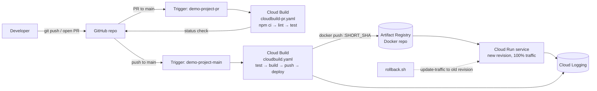

# CI/CD Demo — GitHub → Cloud Build → Artifact Registry → Cloud Run

A minimal but production-shaped pipeline. Push to `main` → tests run → Docker image is built and
pushed to Artifact Registry → a new Cloud Run revision takes 100% of traffic. Pull requests get a
test-only status check. Rollback is a traffic shift, not a redeploy.

Everything is provisioned with plain `gcloud` (no Terraform) in about 3 minutes, plus one manual
click-through in the Console to install the Cloud Build GitHub App.

---

## 1. Architecture



**Identities** — two dedicated service accounts, least privilege:

| Service account | Used by | Roles |
|---|---|---|
| `demo-project-build@…` | Cloud Build | `artifactregistry.writer`, `run.admin`, `logging.logWriter`, plus `iam.serviceAccountUser` **scoped to the runtime SA only** |
| `demo-project-run@…` | the Cloud Run container | none (it only needs an identity) |

Cloud Logging needs no setup — Cloud Run pipes stdout/stderr to it automatically.

---

## 2. Files

| File | What it is |
|---|---|
| `app.js` / `server.js` | Express app: HTML dashboard + 8 JSON endpoints (see API table below) |
| `index.html` | Demo dashboard. Renders itself entirely from the service's own API |
| `app.test.js` | 10 unit tests (`node --test`, no test framework dependency) |
| `Dockerfile` | Multi-stage: deps stage → slim `node:22-alpine` runtime, runs as non-root |
| `cloudbuild-pr.yaml` | PR pipeline: install → lint → test. No build, no deploy. |
| `cloudbuild.yaml` | Main pipeline: test → build → push → deploy. Fully parameterised. |
| `setup-gcp.sh` | One-shot provisioning. Idempotent, pauses for the GitHub App step. |
| `rollback.sh` | Lists revisions, shifts 100% traffic to the one you pick. |
| `.env.example` | Every environment-specific value. **No project IDs are committed.** |

---

## 2a. API surface

Open the service root in a browser and you get a dashboard that fetches every value below
from the service itself - nothing is hardcoded in the HTML. Each endpoint has a **Run**
button that shows the live JSON response and status code.

| Method | Path | Returns |
|---|---|---|
| `GET` | `/` | HTML dashboard |
| `GET` | `/health` | `200 {status, version, revision, region, uptime, timestamp}`, or `500` when `BREAK_HEALTH=true` |
| `GET` | `/api/info` | Runtime metadata: version, revision, region, uptime, node version, env |
| `GET` | `/api/items` | `{count, items[]}` |
| `GET` | `/api/items/:id` | One item, or `404` |
| `POST` | `/api/items` | `{"name":"..."}` -> `201` with the created item; `400` if name is missing |
| `DELETE` | `/api/items/:id` | `204`, or `404` |
| `GET` | `/api/echo?a=1` | Echoes the query string back |
| `GET` | `/api/error` | Always `500` - shorthand for the common case |
| `GET` | `/api/status/:code` | Returns **that exact status code**. Any value 100-599; `400` if invalid |
| `GET` | `/api/break` | Current break state: `{broken, code, simulatable}` |
| `POST` | `/api/break` | `{"code":502}` - **sticky**: every data endpoint keeps returning that code |
| `DELETE` | `/api/break` | Recover - back to normal |

Every request is logged as structured JSON with a `severity` field, so Cloud Logging
parses and colour-codes it automatically. The items store is in-memory and resets on each
new revision - a deliberate illustration that Cloud Run containers are stateless.

### Simulating failures

Two ways, both driven from the dashboard's **Break the API** card or from curl.

**One-off** - a single response with the code you name. Supported: `400 401 403 404 409 422 429 500 502 503 504`
(any code 100-599 works; the listed ones get a proper status text).
```bash
curl -i -s $URL/api/status/403 | head -1     # HTTP/2 403
curl -i -s $URL/api/status/502 | head -1     # HTTP/2 502
```

**Sticky** - puts the service into a failing state until you recover it. This is the one to use
when you want to show sustained errors in the Cloud Run **Logs** tab or a monitoring chart.
```bash
curl -s -X POST $URL/api/break -H 'Content-Type: application/json' -d '{"code":502}'
curl -i -s $URL/api/items | head -1          # HTTP/2 502, and stays 502
curl -s -X DELETE $URL/api/break             # recover
```

`/health`, `/api/break` and `/api/status/:code` deliberately stay reachable while break mode is on,
so the container is never killed by Cloud Run's health checking and you can always recover.
Responses at `4xx` log as `WARNING`, `5xx` as `ERROR`, so they are filterable in Cloud Logging.

> Use `BREAK_HEALTH=true` (not break mode) for the rollback demo in section 6 - that one breaks
> `/health` itself, which is what makes the revision genuinely bad.

Quick check against the deployed service:
```bash
URL=$(gcloud run services describe demo-project --region asia-south1 --format='value(status.url)')
curl -s $URL/api/info | jq
curl -s -X POST $URL/api/items -H 'Content-Type: application/json' -d '{"name":"from curl"}' | jq
curl -s $URL/api/items | jq
open $URL     # the dashboard
```

---

## 3. Prerequisites

1. **A GCP project with billing enabled.** Note the project ID.
2. **gcloud CLI installed and authenticated:**
   ```bash
   gcloud auth login
   gcloud auth application-default login
   gcloud config set project YOUR_PROJECT_ID
   ```
   You need `roles/owner` (or Project IAM Admin + Service Account Admin + Cloud Build Editor).
3. **A GitHub repo** containing this code, with a `main` branch, that you can install an app on.
4. **Node.js 20+** locally, only if you want to run the tests before pushing.

---

## 4. Setup — numbered steps

**Step 1 — configure.**
```bash
cp .env.example .env
```
Edit `.env` and fill in `PROJECT_ID`, `REGION`, `GITHUB_OWNER`, `GITHUB_REPO`.
`.env` is git-ignored; nothing secret ever gets committed.

**Step 2 — push this code to GitHub** (the triggers reference a real repo, so it must exist first).
```bash
git init && git add . && git commit -m "Initial CI/CD demo"
git branch -M main
git remote add origin git@github.com:OWNER/REPO.git
git push -u origin main
```

**Step 3 — run the setup script.** It prints exactly what it will create and waits for `y`.
```bash
./setup-gcp.sh
```
It then does, in order:
1. Enables Cloud Build, Cloud Run, Artifact Registry, IAM APIs.
2. Creates the Artifact Registry Docker repo.
3. Creates both service accounts and grants the IAM roles above.

**Step 4 — the manual GitHub connection (the script pauses here).**
gcloud cannot install the Cloud Build GitHub App, so do this in the Console:
1. Open **Cloud Build → Triggers** → set the region selector to your region.
2. Click **CONNECT REPOSITORY**.
3. Source: **GitHub (Cloud Build GitHub App)** → Continue.
4. Authenticate with GitHub, install/authorize the app on your repo.
5. Tick the repo, accept the terms, click **CONNECT**.
6. On the "Create a trigger" screen click **DONE / SKIP FOR NOW** — the script creates the triggers.

Return to the terminal and answer `y`.

**Step 5 — the script creates both triggers** and prints the Cloud Build History URL.

> **Note on regions:** the Cloud Build GitHub App (1st gen) connects repos in **`global`**, so both
> triggers are created with `--region=global`. Artifact Registry and Cloud Run stay in `asia-south1`.
> Mixing these up produces `FAILED_PRECONDITION: Repository mapping does not exist` - see
> Troubleshooting C.

**Step 6 - verify.**
```bash
gcloud builds triggers list --region=global --format='table(name,github.name,filename)'
```
You should see `demo-project-pr` and `demo-project-main`.

---

## 5. Demo script (run this live)

> Keep three browser tabs open beforehand: **Cloud Build → History**, **Cloud Run → your service**,
> and your GitHub repo.

**1. Show the app and the tests locally** (5 seconds, proves the pipeline isn't magic):
```bash
npm test
```

**2. Show the PR check.** Create a branch, make a visible change, open a PR:
```bash
git checkout -b demo-change
sed -i '' 's/"version": "1.0.0"/"version": "1.1.0"/' package.json
git commit -am "Bump version to 1.1.0"
git push -u origin demo-change
gh pr create --fill --base main     # or open the PR in the GitHub UI
```
→ In the **GitHub PR page**, scroll to the checks box. `demo-project-pr` appears as a pending check,
then turns green. Click **Details** — it deep-links into the Cloud Build log.
→ Point out: this build ran `lint` and `test` only. **No image was built, nothing was deployed.**

**3. Merge the PR** (GitHub UI, "Merge pull request"). This is the push to `main`.

**4. Watch the main pipeline.** Console → **Cloud Build → History**:
```
https://console.cloud.google.com/cloud-build/builds
```
Click the running build. Walk through the four steps in the left pane as they go green:
`install → test → build → push → deploy`. Total ~2 minutes.

**5. Show the image that was produced.** Console → **Artifact Registry → demo-project**, or:
```bash
gcloud artifacts docker tags list \
  asia-south1-docker.pkg.dev/$PROJECT_ID/demo-project/demo-project
```
→ Point out the tag is the **commit SHA** — every image traces back to one commit.

**6. Show the new revision.** Console → **Cloud Run → demo-project → REVISIONS tab**.
→ A new revision appears at 100% traffic; the previous one drops to 0% but still exists.
   That surviving revision is what makes the rollback instant.

**7. Hit the live service:**
```bash
URL=$(gcloud run services describe demo-project --region asia-south1 --format='value(status.url)')
curl -s $URL/health | jq
```
→ Shows `"version": "1.1.0"` — the change you merged 2 minutes ago is live.

**8. Show the logs.** Console → **Cloud Run → demo-project → LOGS tab**. The request you just made
is there. Or from the terminal:
```bash
gcloud run services logs read demo-project --region asia-south1 --limit 20
```

---

## 6. Rollback demo

**1. Record the good revision — you'll roll back to this one:**
```bash
gcloud run revisions list --service demo-project --region asia-south1 \
  --sort-by="~metadata.creationTimestamp" --limit 3
```

**2. Ship a deliberately broken deploy through the real pipeline.** Re-run the main trigger with the
substitution flipped, which deploys a revision whose `/health` returns HTTP 500:
```bash
gcloud builds triggers run demo-project-main \
  --region=asia-south1 --branch=main \
  --substitutions=_BREAK_HEALTH=true
```
> Faster alternative if you're short on time (skips the build, still creates a new bad revision):
> ```bash
> gcloud run services update demo-project --region asia-south1 --set-env-vars BREAK_HEALTH=true
> ```

**3. Show it broken, live:**
```bash
curl -i -s $URL/health | head -1      # HTTP/2 500
curl -s $URL/health | jq
```
→ Console → **Cloud Run → REVISIONS**: the broken revision now holds 100% of traffic.
→ Console → **Cloud Run → LOGS**: the 500s are visible in real time.

**4. Roll back:**
```bash
./rollback.sh
```
It prints the revision table and the current traffic split, asks which revision to promote, shows
you the exact command, and waits for confirmation. The command it runs is:

```bash
gcloud run services update-traffic demo-project \
  --region asia-south1 \
  --to-revisions REVISION_NAME=100
```

Or skip the prompt entirely:
```bash
./rollback.sh demo-project-00004-xyz
```

**5. Show it healthy again** — the script curls `/health` for you; it returns 200 in a couple of
seconds. Refresh the **REVISIONS** tab: traffic is back on the old revision.

→ **The point to make:** no rebuild, no redeploy, no waiting on CI. The old image was already in
Artifact Registry and the old revision was still warm — recovery is a routing change measured in
seconds, not a pipeline run measured in minutes.

---

## 7. Troubleshooting (the three that actually bite during a demo)

### A. Image push fails — `denied: Permission "artifactregistry.repositories.uploadArtifacts" denied`

The Cloud Build service account is missing the writer role, or the build is running as a different
SA than you think.

```bash
# Confirm which SA the trigger uses
gcloud builds triggers describe demo-project-main --region=global --format='value(serviceAccount)'

# Re-grant
gcloud projects add-iam-policy-binding $PROJECT_ID \
  --member="serviceAccount:demo-project-build@$PROJECT_ID.iam.gserviceaccount.com" \
  --role="roles/artifactregistry.writer"
```
Also check the repo region matches the image hostname: an image tagged
`asia-south1-docker.pkg.dev/...` cannot be pushed to a repo created in `us-central1`.

**Related:** if the build fails instantly with *"could not resolve source ... service account does
not have permission to write logs"*, the SA is missing `roles/logging.logWriter`. Builds running as
a custom SA **must** also have `options: logging: CLOUD_LOGGING_ONLY` in the YAML — both configs
here already do.

### B. Cloud Run revision fails to start — `The user-provided container failed to start and listen on the port`

Almost always one of three things:
1. **The app isn't listening on `$PORT`.** Cloud Run injects `PORT`; `server.js` reads it and falls
   back to 8080. Don't hardcode a different port.
2. **It's bound to `localhost`.** It must bind `0.0.0.0` — Express's default `listen(port)` does.
3. **The container crashed on boot.** Read the actual error:
   ```bash
   gcloud run revisions list --service demo-project --region asia-south1
   gcloud run services logs read demo-project --region asia-south1 --limit 50
   ```
Reproduce locally in one line:
```bash
docker build -t demo-project:local . && docker run -p 8080:8080 -e PORT=8080 demo-project:local
```
A failed revision never receives traffic, so the previous revision keeps serving — the demo stays up.

### C. Trigger doesn't fire on push

1. **Is the connection still there?** Console → Cloud Build → Triggers. If the repo shows as
   disconnected, the GitHub App was removed or the token expired — reconnect (Step 4).
2. **Region mismatch - the one that actually bites.** Triggers are regional, but a **1st-gen
   GitHub App connection stores its repo mapping in `global`**. Creating a trigger in a region
   against that mapping fails with:

   > `FAILED_PRECONDITION: Repository mapping does not exist.`

   The fix is to create and list the triggers with `--region=global`. The build still deploys to
   Cloud Run in `asia-south1` - only the trigger itself is global. Always pass `--region`:
   ```bash
   gcloud builds triggers list --region=global
   ```
3. **Branch pattern mismatch.** The push trigger matches `^(main|master)$` and the PR trigger fires
   on a PR into *any* base branch. If you renamed your default branch to something else, update the
   pattern. Check with:
   ```bash
   gcloud builds triggers describe demo-project-main --region=global \
     --format='value(github.push.branch, github.pullRequest.branch)'
   ```
4. **Force it while you debug** (works regardless of webhooks):
   ```bash
   gcloud builds triggers run demo-project-main --region=global --branch=main
   ```
5. **Check GitHub's side:** repo → Settings → GitHub Apps → Google Cloud Build → *Recent Deliveries*
   shows whether the webhook was sent and what GCP answered.

---

## 8. Cleanup

```bash
# Cloud Run service
gcloud run services delete demo-project --region asia-south1 --quiet

# Artifact Registry repo (deletes all images in it)
gcloud artifacts repositories delete demo-project --location asia-south1 --quiet

# Triggers
gcloud builds triggers delete demo-project-main --region=global --quiet
gcloud builds triggers delete demo-project-pr   --region=global --quiet

# Service accounts
gcloud iam service-accounts delete demo-project-build@$PROJECT_ID.iam.gserviceaccount.com --quiet
gcloud iam service-accounts delete demo-project-run@$PROJECT_ID.iam.gserviceaccount.com   --quiet
```
Disconnecting the GitHub App itself is manual: GitHub → Settings → Applications → Google Cloud Build → Configure → Uninstall.
